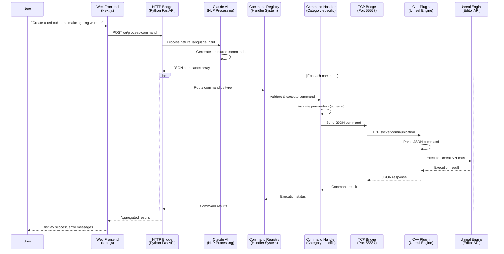
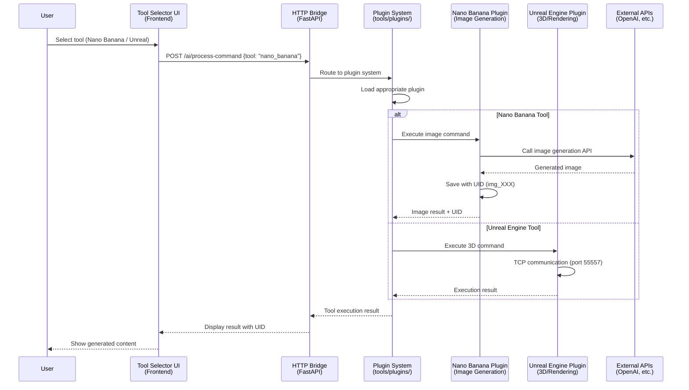
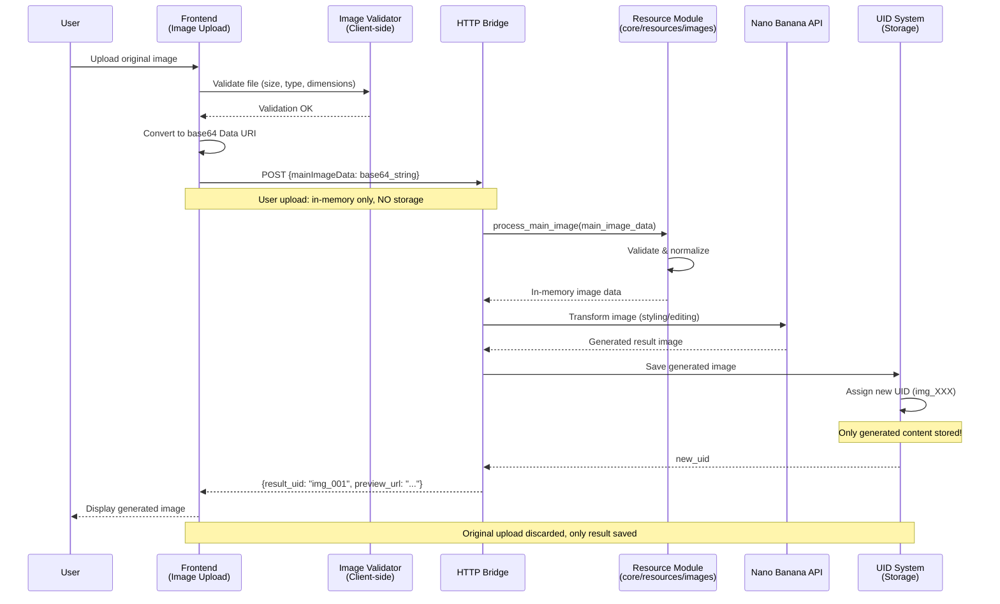
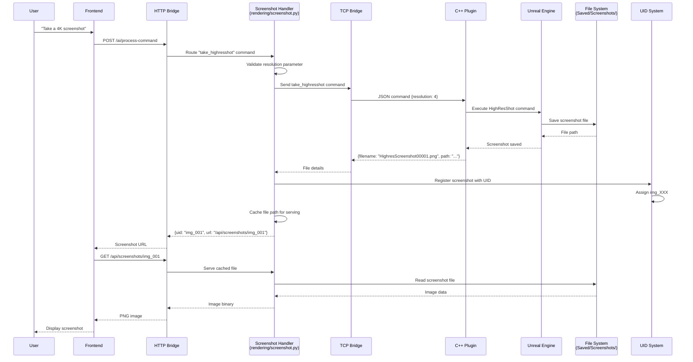
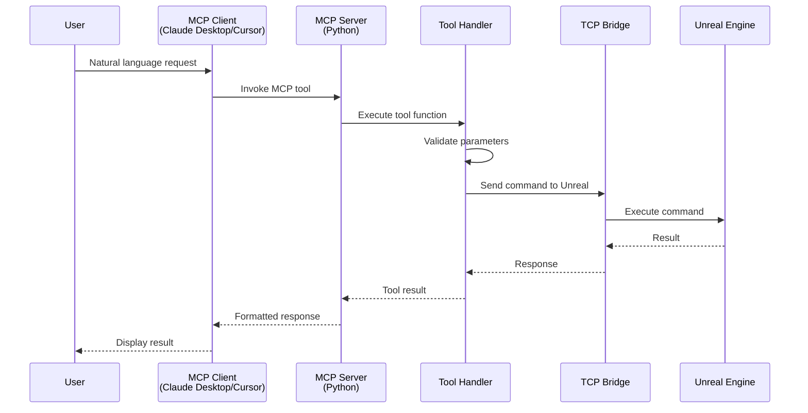
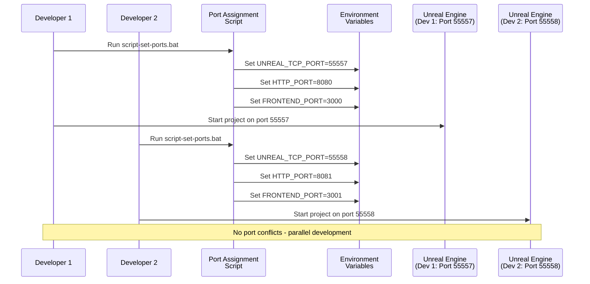
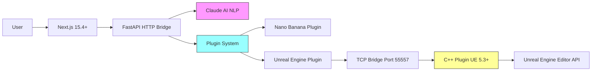

# MegaMelange (Creative Hub) - Sequence Diagrams

## 1. End-to-End Natural Language Command Flow



## 2. Multi-Tool Creative Hub Flow (NEW Architecture)



## 3. Image Processing Flow (Copyright-Safe)



## 4. Screenshot Capture & Serving Flow



## 5. MCP Client Integration Flow



## 6. Command Handler Registration & Routing

```mermaid
sequenceDiagram
    participant Init as System Init
    participant Registry as Command Registry<br/>(main.py)
    participant Actor as Actor Handlers<br/>(actor/*.py)
    participant Render as Rendering Handlers<br/>(rendering/*.py)
    participant Plugin as Plugin Handlers<br/>(plugins/*.py)

    Init->>Registry: Initialize registry
    Registry->>Actor: Import actor handlers
    Actor-->>Registry: Register: UDS, Cesium, Light, Actor
    Registry->>Render: Import rendering handlers
    Render-->>Registry: Register: Screenshot, Materials, Camera
    Registry->>Plugin: Import plugin handlers
    Plugin-->>Registry: Register: Nano Banana, etc.
    Registry->>Registry: Build command map

    Note over Registry: Runtime: Command arrives
    Registry->>Registry: Lookup handler by command type
    Registry->>Actor: Route to appropriate handler
    Actor->>Actor: Validate & execute
    Actor-->>Registry: Execution result
```

## 7. Multi-Developer Environment Setup



## Key Interaction Patterns

### 1. Command Validation Pattern
- **Client-side**: File validation (images, uploads)
- **Python Handler**: Schema validation (parameters, types)
- **C++ Plugin**: Unreal API parameter validation

### 2. Error Propagation
```
User Input → Frontend → HTTP Bridge → Handler → TCP → C++ → Unreal
                ↓          ↓           ↓        ↓      ↓       ↓
            UI Error   HTTP Error   Handler   TCP    C++   UE API
                                    Error    Error  Error  Error
                                       ↓
                                All errors bubble up to user
```

### 3. Resource Management
- **User Uploads**: In-memory only, discarded after processing
- **Generated Content**: Saved with UID, tracked in database
- **Screenshots**: Cached file paths, served via HTTP

### 4. Tool Routing Priority
1. Check tool selector (frontend)
2. Analyze command capabilities (NLP)
3. Route to appropriate plugin
4. Execute via plugin-specific handler

## Technology Stack Flow


