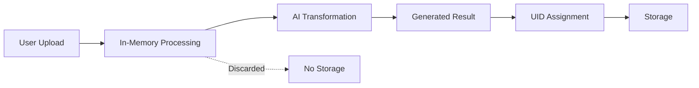
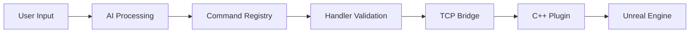

# CLAUDE.md

This file provides guidance to Claude Code (claude.ai/code) when working with code in this repository.

## Target User & Design Philosophy

**Primary User**: Creative professionals in their 20's (directors, cinematographers, technical artists) working with Unreal Engine for film, game development, and virtual production.

**Core Principles**:
- **Intuitive Creative Control**: Natural language commands for complex Unreal Engine operations
- **Professional Workflow Integration**: Support for industry-standard pipelines and tools
- **Real-time Iteration**: Immediate visual feedback for creative decision-making
- **Modular Extensibility**: Easy addition of new creative tools and rendering features
- **Cross-Platform Accessibility**: Web interface, MCP clients, and direct API access 

## Table of Contents

- [Project Overview](#project-overview)
- [Quick Start](#quick-start)
- [Architecture](#architecture)
- [Copyright & Image Handling Policy](#copyright--image-handling-policy)
- [Development Guide](#development-guide)
- [Command Extension Guide](#command-extension-guide)
- [Configuration](#configuration)
- [API Reference](#api-reference)
- [Troubleshooting](#troubleshooting)

---

## Project Overview

**MegaMelange (Creative Hub)** is an AI-powered multi-tool creative platform that enables natural language control for Unreal Engine, AI image generation, and other creative tools through multiple interfaces.

> **🎉 NEW: Creative Hub Architecture** - Now supports multiple tools beyond Unreal Engine!
> - See [CREATIVE_HUB_ARCHITECTURE.md](CREATIVE_HUB_ARCHITECTURE.md) for full architecture details
> - See [INTEGRATION_GUIDE.md](INTEGRATION_GUIDE.md) for migration guide

### System Components

| Component | Technology | Purpose |
|-----------|------------|---------|
| **Web Frontend** | Next.js 15.4+ | Claude-powered web interface with tool selector |
| **Python Backend** | FastMCP + Plugin System | HTTP bridge with multi-tool support |
| **Tool Plugins** | Python Plugins | Nano Banana, Unreal Engine, future tools |
| **C++ Plugin** | UE 5.3+ | Native plugin with TCP server (port 55557) |
| **Sample Project** | Unreal Engine | Pre-configured project with plugin integration |

**Available Tools:**
- 🍌 **Nano Banana**: AI-powered image generation, editing, style transfer
- 🎮 **Unreal Engine**: Real-time 3D creation, rendering, lighting
- 🔧 **Extensible**: Easy to add new tools via plugin system

### Core Communication Flow

```
User Input → AI Processing → Tool Registry → Plugin System → Tool Execution
                                    ↓
                              Tool Selector UI
```

**Key Features:**
- **Multi-Tool Support**: Integrated plugin system for Unreal Engine, Nano Banana, and more
- **Natural Language Understanding**: Claude-3-Haiku processes user intent into actionable commands
- **Capability-Based Routing**: Commands automatically route to the right tool
- **Real-time Communication**: HTTP API with TCP bridge for Unreal Engine
- **Multi-Interface Support**: Web UI with tool selector, MCP clients (Claude Desktop, Cursor, Windsurf)
- **Resource Management**: Unified handling of images, videos, and 3D objects

---

## Quick Start

### Prerequisites
- **Unreal Engine 5.3+** (tested on 5.5.4)
- **Python 3.8+** with `uv` package manager
- **Node.js 18+** for frontend development
- **Visual Studio 2022** for C++ compilation

### Setup Commands

#### 1. Python Backend (Creative Hub)
```bash
cd Python

# Setup environment
uv venv                     # Create virtual environment
source .venv/bin/activate   # Unix: activate venv
# .venv\Scripts\activate    # Windows: activate venv
uv pip install -e .        # Install in development mode

# Configure (copy .env.example to .env and edit)
cp .env.example .env
# Edit .env: Set API keys and feature flags

# Run migration check (optional)
python migrate_to_creative_hub.py --check

# Start HTTP bridge server
python http_bridge.py       # Starts on http://localhost:8080

# Verify plugin system
python test_plugin_system.py
```

#### 2. Web Frontend  
```bash
cd Frontend
npm install                 # Install dependencies
npm run dev                 # Start development server
npm run build               # Build for production
npm run lint                # Run ESLint
```

#### 3. Unreal Engine Project
1. Open `MCPGameProject/MCPGameProject.uproject`
2. Right-click .uproject → **Generate Visual Studio project files**
3. Build in **Development Editor** configuration
4. Plugin builds automatically with project

### Testing
```bash
cd Python
python scripts/tests/test_example_integration.py
python tests/test_connection.py

# Category-specific tests
python scripts/actors/test_get_actors.py
python scripts/blueprints/test_create_and_spawn_cube_blueprint.py
```

---

## Copyright & Image Handling Policy

### Core Policy: Generated-Only Storage

**MegaMelange does NOT store, save, or retain user-uploaded original images.** This policy protects against copyright infringement and liability issues.

#### What IS Stored (Generated Content Only)
- ✅ **Unreal Engine Screenshots**: Captures from the viewport
- ✅ **Generated Transformations**: AI-styled images, filters, edits
- ✅ **Rendered Videos**: Unreal sequence renders, animations
- ✅ **Generated 3D Assets**: Procedurally created FBX, meshes

All stored content receives a UID (`img_XXX`, `vid_XXX`, `obj_XXX`, `fbx_XXX`) for tracking.

#### What IS NOT Stored (User Content)
- ❌ **User-Uploaded Images**: Original photos, artwork, references
- ❌ **Reference Images**: Style references, inspiration images
- ❌ **Main Image Uploads**: Source images for transformation

User-uploaded content is **processed in-memory only** and discarded after generation.

### Use Case: First-Time Image Generation

When a user uploads their own image to generate styled content:



**Flow Details:**
1. **User uploads original image** (main image) and optional reference images
2. **Frontend processes**: Validates and converts to base64 Data URI
3. **Backend receives**: `main_image_data` parameter with base64 content
4. **AI processes**: Transforms image using NanoBanana or other APIs
5. **Result stored**: Generated output saved with new UID (e.g., `img_001`)
6. **Original discarded**: User upload never touches disk, no UID assigned

### Technical Implementation

#### Backend: Resource Processing Module

Location: `Python/core/resources/images/`

```python
from core.resources.images import process_main_image, process_reference_images

# Dual-source support: UID or user upload
target_uid, main_image_data = process_main_image(
    main_image_request={'data': base64_string, 'mime_type': 'image/png'},
    target_image_uid='img_001'  # Optional: use existing screenshot
)

# Reference images: in-memory only, no storage
reference_images = process_reference_images([
    {'data': base64_string, 'mime_type': 'image/jpeg'}
])
```

**Key Functions:**
- `process_main_image()`: Handles both UID lookup and user uploads
- `process_reference_images()`: Validates and normalizes reference images
- `load_image_from_uid()`: Retrieves stored generated images

#### Frontend: Image Utilities

Location: `Frontend/src/app/utils/images/`

```typescript
import { ImageProcessor } from '@/app/utils/images';

// Convert file to Data URI for transmission
const dataUri = await ImageProcessor.fileToDataUri(file);

// Full processing with validation
const processed = await ImageProcessor.processUpload(file);
// Returns: { data, mime_type, size_kb, width, height }

// Create preview URL (revoke when done)
const preview = ImageProcessor.createPreviewUrl(file);
// Later: ImageProcessor.revokePreviewUrl(preview);
```

**Key Classes:**
- `ImageValidator`: Client-side validation (size, type, dimensions)
- `ImageProcessor`: File-to-base64 conversion, dimension extraction
- `ImageData`, `ProcessedImage`, `ImageUpload`: TypeScript type definitions

#### Integration Points

**HTTP Bridge** (`Python/http_bridge.py:766-804`)
```python
# Support dual image sources
target_uid, main_image_data = process_main_image(
    main_image_request=request_data.get('mainImageData'),
    target_image_uid=request_data.get('target_image_uid')
)
```

**NLP Processing** (`Python/tools/ai/nlp.py:339-384`)
```python
# Priority order for image sources:
# 1. target_image_uid (existing screenshot)
# 2. main_image_data (user upload, in-memory)
# 3. images (legacy base64 method)
```

**Command Handlers** (`Python/tools/ai/command_handlers/nano_banana/image_edit.py:217-281`)
```python
# Handle both UID and upload sources
if target_image_uid:
    # Load from UID system
    parent_uid = target_image_uid
elif main_image_data:
    # Use in-memory upload
    parent_uid = None  # No parent for user uploads
```

### Legal & Compliance

**Copyright Protection:**
- User retains full copyright to uploaded images
- System only stores derivative works (generated results)
- Clear separation between user content and generated content

**Data Privacy:**
- No persistent storage of user-uploaded images
- In-memory processing only
- Reference images discarded after transformation

**Attribution:**
- Generated images track source via `parent_uid` (if from screenshot)
- User uploads marked with `source: 'user_upload'` in metadata
- Clear distinction in UID database

### Developer Guidelines

**When Adding Image-Processing APIs:**
1. Use `core.resources.images` for reusable image handling
2. Accept both `target_image_uid` (UID) and `main_image_data` (upload)
3. Process reference images in-memory, never store
4. Only assign UIDs to generated output
5. Add `source` field to metadata (`'screenshot'` or `'user_upload'`)

**Example:**
```python
from core.resources.images import process_main_image

# Your API handler
def your_image_api(params: Dict[str, Any]):
    target_uid, main_image_data = process_main_image(
        main_image_request=params.get('mainImageData'),
        target_image_uid=params.get('target_image_uid')
    )

    # Process and generate result
    result_path = generate_output(target_uid or main_image_data)

    # Only generated result gets UID
    new_uid = add_uid_mapping(
        generate_uid('img'),
        'image',
        result_filename,
        parent_uid=target_uid,  # None if from user upload
        metadata={'source': 'user_upload' if not target_uid else 'screenshot'}
    )
```

---

## Architecture

### End-to-End Flow: Natural Language → Unreal Engine



#### 1. **User Input** (`Frontend/src/app/components/UnrealAIChat.tsx`)
- Natural language: *"Create a red cube and make the lighting warmer"*
- Web interface or MCP client input

#### 2. **AI Processing** (`Python/tools/ai/nlp.py`)
```python
# Claude-3-Haiku processes user intent
client = anthropic.Anthropic(api_key=api_key)
response = client.messages.create(
    model='claude-3-haiku-20240307',
    max_tokens=1024,
    temperature=0.1,
    messages=[{"role": "user", "content": f"{system_prompt}\n\nUser request: {user_input}"}]
)
```

#### 3. **Command Generation**
AI returns structured JSON:
```json
{
  "explanation": "Creating a red cube and adjusting lighting to warmer temperature",
  "commands": [
    {"type": "create_actor", "params": {"name": "RedCube", "type": "StaticMeshActor"}},
    {"type": "set_color_temperature", "params": {"description": "warmer"}}
  ],
  "expectedResult": "Red cube created and lighting made warmer"
}
```

#### 4. **Modular Handler System** (`Python/tools/ai/command_handlers/`)
- **Command Registry**: Routes commands to specialized handlers by category
- **Handler Validation**: Schema-based parameter validation  
- **Preprocessing**: Apply defaults, normalize parameters
- **Category-based Organization**: Actor, Rendering, and extensible command categories

#### 5. **TCP Communication** (Port 55557)
- Python MCP server → C++ Unreal plugin
- JSON command serialization

#### 6. **C++ Plugin Execution** (`MCPGameProject/Plugins/UnrealMCP/`)
- Command handlers execute Unreal API calls
- Editor Scripting API integration

### System Components

#### Python MCP Server (`Python/`)
```
tools/
├── ai/
│   ├── command_handlers/        # Modular command handlers by category
│   │   ├── main.py             # BaseCommandHandler + Registry
│   │   ├── actor/              # Actor manipulation commands
│   │   │   ├── uds.py         # Ultra Dynamic Sky (with temperature utils)
│   │   │   ├── cesium.py      # Geospatial commands
│   │   │   ├── light.py       # MM Control Lights
│   │   │   └── actor.py       # Generic actor operations
│   │   └── rendering/          # Rendering & capture commands
│   │       ├── screenshot.py   # High-res screenshots (active)
│   │       ├── materials.py    # Material parameters (boilerplate)
│   │       └── camera.py       # Camera/viewport control (boilerplate)
│   ├── nlp.py                  # Natural language processing
│   └── nlp_schema_validator.py # Parameter validation
├── actor_tools.py              # Legacy MCP tools
├── blueprint_tools.py
└── utils/
```

#### C++ Plugin (`MCPGameProject/Plugins/UnrealMCP/`)
```
Source/UnrealMCP/
├── Public/
│   └── UnrealMCPBridge.h       # Main bridge interface
├── Private/
│   ├── UnrealMCPBridge.cpp     # TCP server management
│   ├── Commands/               # Command handlers
│   │   ├── UnrealMCPActorCommands.cpp
│   │   ├── UnrealMCPBlueprintCommands.cpp
│   │   └── UnrealMCPEditorCommands.cpp
│   └── MCPServerRunnable.cpp   # TCP server thread
```

---

## Development Guide

### Unreal Engine Specifics
- **Coordinate System**: Z-up, left-handed (X=forward/red, Y=right/green, Z=up/blue)
- **Units**: Centimeters for distance, degrees for rotation
- **Plugin Type**: Editor-only with TCP server on port 55557
- **API**: Uses Unreal's Editor Scripting utilities

### Python Development Guidelines

#### MCP Tool Creation
```python
@mcp.tool()
def your_tool_name(param1: str, param2: int = 100) -> Dict[str, Any]:
    """Tool description with parameter details."""
    # Avoid: Any, object, Optional[T], Union[T]
    # Use: x: T = None instead of x: T | None = None
    return {"result": "success"}
```

#### Command Handler Pattern
```python
class YourCommandHandler(BaseCommandHandler):
    def get_supported_commands(self) -> List[str]:
        return ["your_command_1", "your_command_2"]
    
    def validate_command(self, command_type: str, params: Dict[str, Any]) -> ValidatedCommand:
        # Implement parameter validation
        pass
    
    def execute_command(self, connection, command_type: str, params: Dict[str, Any]) -> Any:
        # Execute via TCP connection
        pass
```

### C++ Development Guidelines

#### Command Handler Pattern
```cpp
// In header file
TSharedPtr<FJsonObject> HandleYourCommand(const TSharedPtr<FJsonObject>& Params);

// In HandleCommand method
else if (CommandType == TEXT("your_command"))
{
    return HandleYourCommand(Params);
}

// Implementation
TSharedPtr<FJsonObject> FUnrealMCPActorCommands::HandleYourCommand(const TSharedPtr<FJsonObject>& Params)
{
    // Extract parameters
    FString RequiredParam;
    if (!Params->TryGetStringField(TEXT("required_param"), RequiredParam))
    {
        return FUnrealMCPCommonUtils::CreateErrorResponse(TEXT("Missing 'required_param'"));
    }
    
    // Execute Unreal operations
    // ...
    
    // Return success response
    TSharedPtr<FJsonObject> ResultObj = MakeShared<FJsonObject>();
    ResultObj->SetStringField(TEXT("message"), TEXT("Command executed successfully"));
    return ResultObj;
}
```

### Multi-Developer Setup

#### Port Configuration
| Developer | TCP Port | HTTP Port | Frontend Port |
|-----------|----------|-----------|---------------|
| Dev 1     | 55557    | 8080      | 3000         |
| Dev 2     | 55558    | 8081      | 3001         |
| Dev 3+    | 55559+   | 8082+     | 3002+        |

Use `script-set-ports.bat` for automated port assignment.

#### Environment Variables
```bash
# Required for cross-machine testing
export UNREAL_TCP_HOST=192.168.1.100
export UNREAL_TCP_PORT=55557

# API Keys (REQUIRED)
GOOGLE_API_KEY=your_google_key_here  # Python .env (REQUIRED for NLP + Image Gen)

# API Keys (Optional)
ANTHROPIC_API_KEY=your_anthropic_key  # Python .env (optional - alternative NLP)
OPENAI_API_KEY=your_openai_key_here  # .env.local (optional - future use)

# Project Path Configuration (NEW - for screenshot serving)
UNREAL_PROJECT_PATH=E:\CINEVStudio\CINEVStudio  # Windows example
UNREAL_PROJECT_PATH=/Users/dev/Projects/MyProject  # macOS example
```

#### Project Path Resolution for Screenshots

The system now supports flexible project path resolution for serving screenshots across different developer environments:

**Method 1: Environment Variable (Recommended)**
```bash
# In Python/.env file
UNREAL_PROJECT_PATH=E:\CINEVStudio\CINEVStudio
```

**Method 2: Auto-Discovery**
- System automatically searches for `.uproject` files
- Works for most standard project layouts
- No configuration needed

**Method 3: C++ Response Caching**
- C++ plugin provides actual file paths
- Automatically cached for HTTP serving
- Most reliable method

**Setup for Your Project:**
1. Copy `Python/.env.example` to `Python/.env`
2. Set `UNREAL_PROJECT_PATH` to your project directory
3. Screenshots will be served from `{PROJECT_PATH}/Saved/Screenshots/`

---

## Command Extension Guide

Adding new commands to the NLP system is straightforward with the modular handler architecture.

### Step-by-Step Process

#### 1. Define Command Specification
```json
{
  "your_command_name": {
    "params": {
      "required_param": "string (required)",
      "optional_param": "string (optional: 'option1', 'option2')",
      "location": "Vector3 (optional)"
    }
  }
}
```

#### 2. Create Python Handler
Create handler in appropriate category directory (`Python/tools/ai/command_handlers/[category]/your_handler.py`):

```python  
from ..main import BaseCommandHandler
from ...nlp_schema_validator import ValidatedCommand

class YourHandlerCommandHandler(BaseCommandHandler):
    def get_supported_commands(self) -> List[str]:
        return ["your_command_name"]
    
    def validate_command(self, command_type: str, params: Dict[str, Any]) -> ValidatedCommand:
        errors = []
        # Add validation logic
        return ValidatedCommand(command_type, params, len(errors) == 0, errors)
    
    def execute_command(self, connection, command_type: str, params: Dict[str, Any]) -> Any:
        response = connection.send_command(command_type, params)
        if response and response.get("status") == "error":
            raise Exception(response.get("error", "Unknown error"))
        return response
```

#### 3. Register Handler
Update `Python/tools/ai/command_handlers/main.py`:
```python
from .[category].your_handler import YourHandlerCommandHandler

handlers = [
    # ... existing handlers ...
    YourHandlerCommandHandler()
]
```

#### 4. Update Public API  
Update `Python/tools/ai/command_handlers/__init__.py`:
```python
from .[category].your_handler import YourHandlerCommandHandler

__all__ = [
    # ... existing exports ...
    'YourHandlerCommandHandler'
]
```

#### 5. Update System Prompt
Update `Python/tools/ai/nlp.py`:
```python
**Your Category:** your_command_name, other_commands

**Your Category Commands:**
- required_param: Required non-empty string
- optional_param: Optional string ('option1', 'option2')
```

#### 6. Add C++ Support
Update `UnrealMCPActorCommands.cpp`:
```cpp
else if (CommandType == TEXT("your_command_name"))
{
    return HandleYourCommandName(Params);
}
```

### Files Modified Summary
- **Python**: 4 files (1 new, 3 modified)
- **C++**: 2-3 files (all modifications)

---

## Configuration

### MCP Client Setup

#### Claude Desktop
`~/.config/claude-desktop/mcp.json`:
```json
{
  "mcpServers": {
    "unrealMCP": {
      "command": "uv",
      "args": ["--directory", "/path/to/project/Python", "run", "unreal_mcp_server.py"]
    }
  }
}
```

#### Cursor
`.cursor/mcp.json` (project root):
```json
{
  "mcpServers": {
    "unrealMCP": {
      "command": "mcp-proxy",
      "args": ["uv", "--directory", "D:\\path\\to\\project\\Python", "run", "unreal_mcp_server.py"]
    }
  }
}
```

### Environment Variables
- **Frontend**: `OPENAI_API_KEY` in `.env.local`
- **Python**: `ANTHROPIC_API_KEY` in `.env`
- **Networking**: `UNREAL_TCP_HOST`, `UNREAL_TCP_PORT`

---

## API Reference

### Command Format Standards

#### Python NLP Command Format
```json
{
  "type": "command_name",
  "params": {
    "parameter1": "value1",
    "parameter2": "value2"
  }
}
```

#### TCP Command Format (Python → C++)
```json
{
  "command": "command_name",
  "parameter1": "value1",
  "parameter2": "value2"
}
```

### Response Formats

#### Success Response
```json
{
  "success": true,
  "result": {
    "message": "Operation completed successfully",
    "data": {...}
  }
}
```

#### Error Response
```json
{
  "success": false,
  "error": "Error message describing what went wrong"
}
```

### Creative Command Categories

MegaMelange organizes commands by creative workflow categories, enabling intuitive natural language control for professional Unreal Engine operations.

#### Actor Manipulation Commands
| Category | Handler | Purpose | Commands |
|----------|---------|---------|----------|
| **Scene Objects** | `actor.py` | Generic actor operations | `create_actor`, `delete_actor`, `get_actors_in_level`, `set_actor_transform` |
| **Lighting Control** | `light.py` | Cinematic lighting | `create_mm_control_light`, `update_mm_control_light`, `delete_mm_control_light` |
| **Geospatial** | `cesium.py` | Real-world positioning | `set_cesium_latitude_longitude`, `get_cesium_properties` |
| **Sky & Environment** | `uds.py` | Time of day, color temperature | `set_time_of_day`, `set_color_temperature`, `get_ultra_dynamic_sky` |

#### Rendering & Capture Commands  
| Category | Handler | Purpose | Commands |
|----------|---------|---------|----------|
| **Screenshot/Capture** | `screenshot.py` | High-res image capture | `take_highresshot` ✅ |
| **Material Control** | `materials.py` | Material parameters | `set_material_parameter`, `apply_material_to_actor` 🚧 |
| **Camera Control** | `camera.py` | Cinematic camera work | `set_camera_position`, `focus_camera_on_actor` 🚧 |

**Legend**: ✅ Active, 🚧 Boilerplate (C++ implementation needed)

#### Ultra Dynamic Sky Commands
| Command | Purpose | Key Parameters |
|---------|---------|----------------|
| `get_ultra_dynamic_sky` | Get current sky state | None |
| `set_time_of_day` | Set time (HHMM format) | `time_of_day` (0-2400) |
| `set_color_temperature` | Set lighting temperature | `color_temperature` (1500-15000K) |

#### Cesium Geospatial Commands  
| Command | Purpose | Key Parameters |
|---------|---------|----------------|
| `set_cesium_latitude_longitude` | Set map coordinates | `latitude` (-90 to 90), `longitude` (-180 to 180) |
| `get_cesium_properties` | Get current coordinates | None |

#### MM Control Lights Commands
| Command | Purpose | Key Parameters |
|---------|---------|----------------|
| `create_mm_control_light` | Create tagged light | `light_name`, `location`, `intensity`, `color` |
| `get_mm_control_lights` | List all MM lights | None |
| `update_mm_control_light` | Modify light properties | `light_name`, optional properties |
| `delete_mm_control_light` | Remove light | `light_name` |

#### Generic Actor Commands
| Command | Purpose | Key Parameters |
|---------|---------|----------------|
| `get_actors_in_level` | List all actors | None |
| `create_actor` | Spawn new actor | `name`, `type`, optional `location` |
| `delete_actor` | Remove actor | `name` |
| `set_actor_transform` | Move/rotate/scale | `name`, optional transform |

### Parameter Types

#### Vector3
```json
{
  "x": 0.0,
  "y": 0.0, 
  "z": 100.0
}
```

#### RGB Color
```json
{
  "r": 255,
  "g": 255,
  "b": 255
}
```

---

## Troubleshooting

### Common Issues

| Issue | Cause | Solution |
|-------|-------|----------|
| **Connection Failed** | Unreal project not open | Ensure project is open and plugin enabled |
| **Port 55557 in use** | Multiple UE instances | Close other Unreal instances or restart |
| **Build Errors** | Wrong UE version | Verify UE 5.3+ and regenerate project files |
| **MCP Server Not Found** | Python environment | Check virtual environment and `uv` installation |
| **Tool Execution Errors** | Various | Review `unreal_mcp.log` for detailed errors |

### Debug Locations

#### Python Side
- **Logs**: `Python/unreal_mcp.log`
- **Handler Registry**: `Python/tools/ai/command_handlers/main.py`
- **Command Categories**: `Python/tools/ai/command_handlers/[actor|rendering]/`
- **Validation**: `Python/tools/ai/nlp_schema_validator.py`

#### C++ Side  
- **Command Routing**: `UnrealMCPBridge::HandleCommand`
- **Actor Commands**: `UnrealMCPActorCommands.cpp`
- **TCP Server**: `MCPServerRunnable.cpp`

### Validation Points
- **Time Format**: HHMM (0-2400), examples: 600=6AM, 1800=6PM, 2330=11:30PM
- **Temperature Range**: 1500-15000 Kelvin
- **Coordinate Bounds**: Latitude (-90,90), Longitude (-180,180)
- **Color Range**: RGB values 0-255

### Network Configuration
- **Default Port**: 55557 for TCP communication
- **Multi-Developer**: Use port assignment script
- **Cross-Machine**: Set `UNREAL_TCP_HOST` environment variable
- **Firewall**: Ensure ports are open for TCP communication

---

### Quick Reference

#### Essential Commands
```bash
# Start MCP Server
cd Python && uv run unreal_mcp_server.py

# Start Frontend  
cd Frontend && npm run dev

# Test Connection
cd Python && python tests/test_connection.py

# Test Command Registry
cd Python && python -c "from tools.ai.command_handlers import get_command_registry; print('Commands:', len(get_command_registry().get_supported_commands()))"

# Build Plugin
# Open UE project → Generate VS files → Build
```

#### Key File Locations
- **Main Server**: `Python/unreal_mcp_server.py`
- **Command Registry**: `Python/tools/ai/command_handlers/main.py`
- **Actor Commands**: `Python/tools/ai/command_handlers/actor/`
- **Rendering Commands**: `Python/tools/ai/command_handlers/rendering/`
- **C++ Plugin**: `MCPGameProject/Plugins/UnrealMCP/`
- **Web Frontend**: `Frontend/src/app/components/UnrealAIChat.tsx`

#### Creative Workflow Examples
```bash
# Natural language examples for creative professionals:
"Set the time to golden hour and make the lighting warmer"
"Take a high-resolution screenshot at 4K resolution"
"Create a red cube at the origin and focus the camera on it"
"Move the map to Tokyo and adjust the lighting to sunset"
```
- frontend - modal does not trigger refresh data from backend. it only take the data from cached data
- do not add scale on interaction in frontend