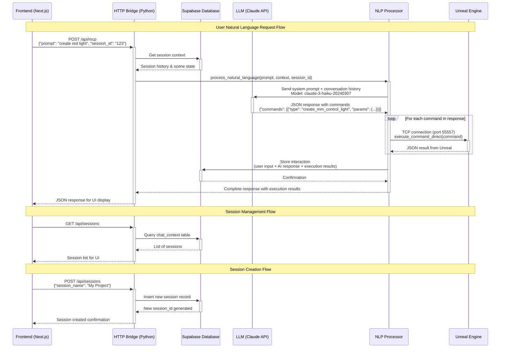

# MegaMelange System Flow - Sequence Diagram

## Component Responsibilities

### Frontend (Next.js)
- User interface for natural language input
- Session management UI
- API route forwarding to Python bridge

### HTTP Bridge (Python)
- Routes requests between Frontend and other components
- Handles session creation/management logic
- Forwards NLP requests to processing layer

### Supabase Database
- Stores session data in `chat_context` table
- Maintains conversation history and scene state
- Provides session persistence across requests

### LLM (Claude API)
- Processes natural language with system prompts
- Returns structured JSON commands
- Uses conversation history for context

### NLP Processor
- Orchestrates LLM interaction
- Validates and executes commands
- Manages session context updates

### Unreal Engine
- Executes commands via TCP server (port 55557)
- Returns execution results as JSON
- Maintains actual 3D scene state